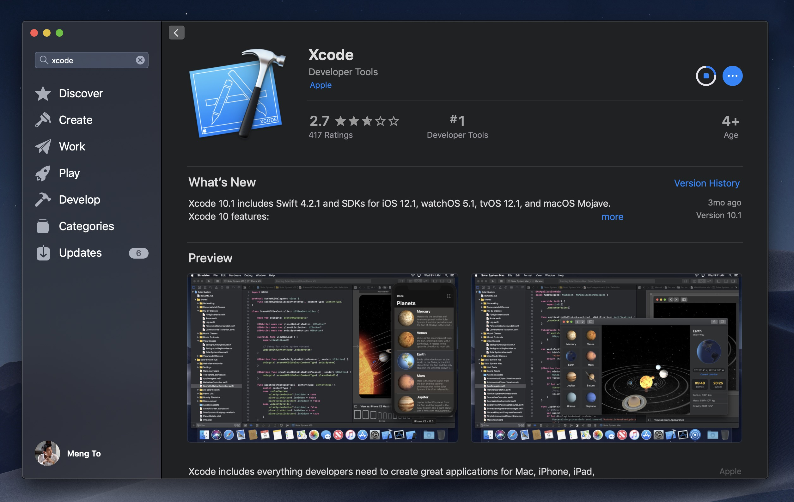
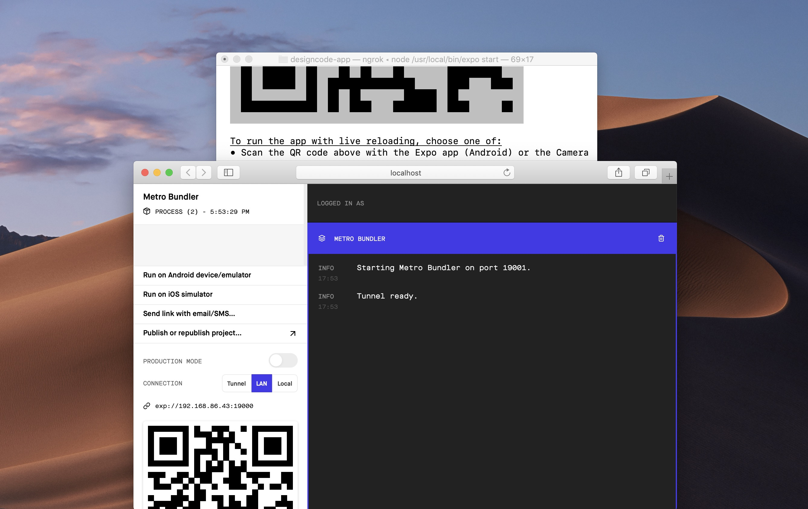

# BLOG APP

This is the repository of Blog App. The app was created as a portfolio item. Associated figma link can me found here ➡ [InVision](https://www.dropbox.com/s/4av17693kc1gxj7/DesignCode-ReactNative.zip?dl=0)

# Overview

This portfolio was made with [React Native](https://reactnative.dev/). [Expo](https://expo.io/) was used to set up development environment so that it's easy to test our app in iOS and Android simulators, and physical devices. I used [Styled Components](https://styled-components.com/) because of its similarity to the syntax in CSS.

Icon assets are going to be vector-based in SVG. For content and CMS (content management system), I used [Contentful](https://www.contentful.com/) and [Appollo](https://www.apollo.io/)/[GraphQL](https://graphql.org/), which allowed me to store my images and texts independently and query them like a database. Like this, when we update the content, we don't need to send an app update.

We're going to use [Redux](https://redux.js.org/) for communicating between components so that one action can influence multiple components at the same time. This is especially useful for persistent states and data. Apart from that, we're going to use as many built-in libraries in the [React Native](https://reactnative.dev/)/[Expo](https://expo.io/) toolbox as possible, like Animated, Gestures, Icons and Navigation.

# Getting Started

Install Node

Before starting, you'll need the Node package manager (NPM) for installing React and Expo. To install Node, you need to head to their site and download the version appropriate to your system. You can also install node using Homebrew (Mac only) if you prefer.

Install Xcode
[](https://1st.sakib.works/)
If you're on a Mac, I highly recommend installing Xcode for the required Command Line Tools and for using the iOS Simulator. Xcode also comes with Git, which is wonderful for development.

In Xcode, make sure to go to Xcode, Preferences, Locations and see that the Command Line Tools are properly installed.

Terminal

To install pretty much any library such as Git or React, you’ll need to use the Terminal. It’s essentially a place you can write commands to run programs for you, such as installing new frameworks or updating your libraries. To open the Terminal, run Spotlight ( Command + Space ) and type Terminal. Once you're there, go to your Downloads folder. You can press Tab to autocomplete Downloads .

```sh
cd Downloads
```

Feel free to put your project on your Desktop or in your Documents instead. The reason I choose Downloads is because iCloud won't interfere with Hot Reload.

Install Expo

[Expo](https://expo.io/) will allow us to have a development environment for creating our app. Go to Terminal and type this command and press Enter.

sudo npm install expo-cli --global

Go to their Quick Start guide for more detailed instructions.
•sudo allows you to install libraries that requires admin privileges. Make sure that your Mac account is set to Admin.
•global means that you can run the expo command from any folder in Terminal.

Create Project
Start building your first React Native project by running this command.

```sh
expo init blog-app •
```

Choose the Blank template.
•Choose managed (default).
•Set the name to "Blog-App". Or, feel free to use any name you wish.
•Install npm.
•Enter the project name and description. Slug should be blog-app.

Go to your new project's folder and start the environment.

```sh
cd designcode-app
expo start
```

The Expo developer tools will open in your browser and you will see a page like this.
[](https://1st.sakib.works/)

## Installation

```sh
# Clone the project.
git clone https://github.com/Code5linger/letter.git
```

## Misc

Follow Sakib Ahmed: [Website](http://www.thecodeslinger.me), [Twitter](https://twitter.com/), [GitHub](https://github.com/)

## License

[MIT](LICENSE)

Made with :blue_heart: by [TheCodeSlinger](http://www.thecodeslinger.me)

[](https://)
[](https://youtu.be/vt5fpE0bzSY)
[](https://youtu.be/BoQ4NVdfwXc)
